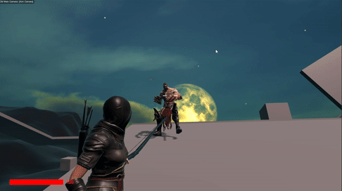

# majik

Majik is a demo game created for a job interview, which had to meet specific requirements:
- Camera:
    - Implement camera functionality to follow the character's movement.
    - Include zoom in/out functionality for the camera.
- Player:
    - Enable character movement using the WASD keys.
    - Implement mouse input for looking around.
    - Allow shooting of bullet objects upon mouse click, which reduces enemy HP.
    - Include a health system for the player, displayed with an HP bar UI.
- Enemy:
    - Create enemy AI with two states: passive and aggressive.
    - Define behavior for enemies to become aggressive within a certain radius and chase the player.
    - Implement the ability for enemies to damage the player with hits.
    - Ensure each enemy has an individual health bar.
- Scene:
    - Implement an enemy spawner within the scene to periodically generate multiple enemies.
    - Include obstacles within the scene that enemies must navigate to reach the player.

Here are some of the gameplay GIFs showcasing different features:

1. Player, Camera, Environment, Arrow Hit Physics \

3. Enemy, HP bars, Ragdoll Physics \

5. Enemy AI behaviour, Combat \

7. Inverse Kinematics \

9. Powerup Mechanic, Ragdoll Physics, Spawner \

